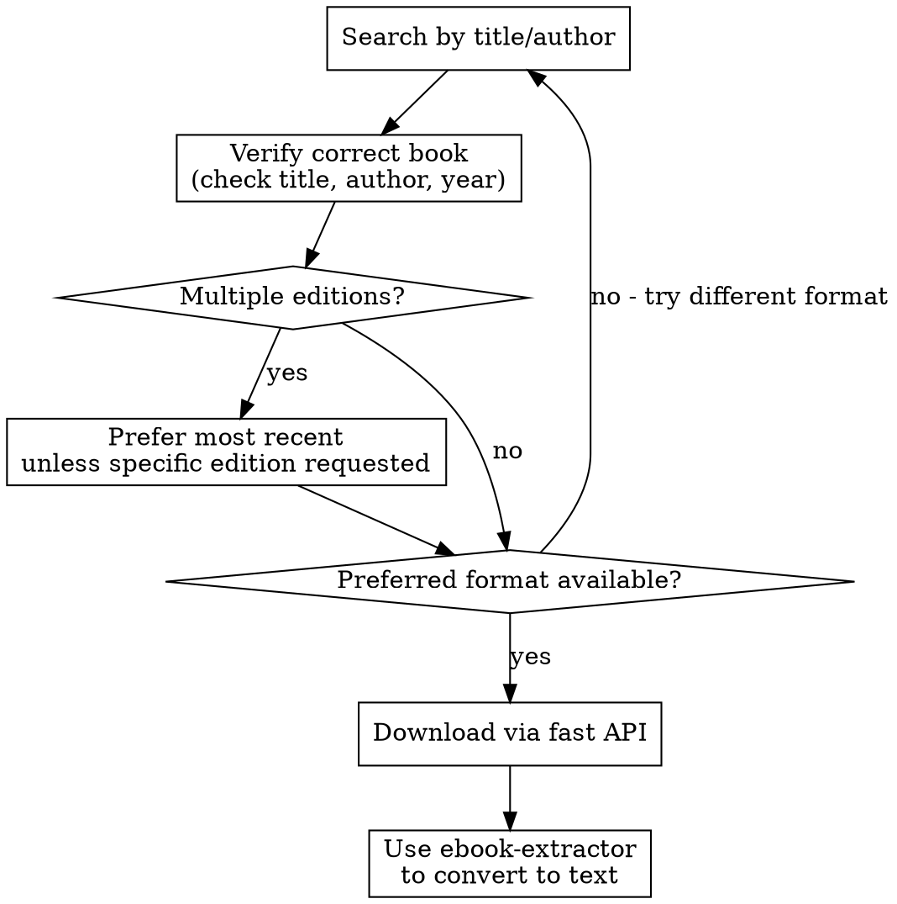

# My Amazon (Kindle) Library Ebook Lookup & Download

## Overview

Internal tool to search and download ebooks from **my personal Amazon (Kindle) library**, i.e., titles I’ve purchased/added to my account (plus any personal documents synced into my library), across available formats.

> Note: This skill is meant for **my own licensed content**. It does not bypass DRM. If a title can’t be downloaded in an accessible file format, use Amazon’s official reading/export options instead.

## Prerequisites

**IMPORTANT: Downloads require an Amazon-library access key for my account.**

Before using download functionality, the user must:

1. Have access to their Amazon (Kindle) library (purchased titles / content library)
2. Set their API key/token: `export LIBRARY_KEY="your-key"`

The key is found in your internal library-proxy/account settings (or whatever system you use to authenticate access to your Amazon library index). Search works without a key, but downloads will fail.

**If key is not set:** Inform the user they need to set `LIBRARY_KEY` and provide the setup instructions above.

## When to Use

* User asks to find/download a book **from their Amazon library**
* Need to look up content from a published book they own
* Searching for a specific edition or format that exists in their library
* "Get me the PDF of Clean Code (from my Kindle library)"
* "Find the latest edition of Design Patterns (that I own)"

## Quick Reference

| Task         | Command                                                              |
| ------------ | -------------------------------------------------------------------- |
| Search       | `python3 scripts/library.py search "query" --format pdf`             |
| Get details  | `python3 scripts/library.py details <md5>`                           |
| Download     | `python3 scripts/library.py download <md5> --output /path/`          |
| Verify match | `python3 scripts/library.py search "title author" --verify "expected title"` |

## Environment Setup

```bash
export LIBRARY_KEY="your-membership-key"
```

The key is found in your Amazon library access setup (internal proxy/token settings).

## Workflow



## Common Patterns

### Find and download a book

```bash
# Search with format preference
python3 scripts/library.py search "Clean Code Robert Martin" --format pdf --limit 5

# Verify it's the right book, get details
python3 scripts/library.py details adb5293cf369256a883718e71d3771c3

# Download
python3 scripts/library.py download adb5293cf369256a883718e71d3771c3 --output ./books/
```

### Handle multiple editions

When search returns multiple editions:

1. Check year - prefer most recent unless user specified edition
2. Check format - match user's preference (pdf/epub)
3. Verify author matches exactly

### Format Priority

Default priority when user doesn't specify: `pdf > epub > mobi > azw3 > djvu`

## API Details

These endpoints refer to your **internal Amazon-library index / proxy service** (backed by your own Amazon account/library data), not a public “find-any-book” catalog.

**Search endpoint:** `https://library-archive.org/search`

* `q` - query string
* `ext` - format filter (pdf, epub, mobi, azw3, djvu)
* `sort` - `year_desc` for most recent first

**Fast download API:** `https://library-archive.org/dyn/api/fast_download.json`

* `md5` - book identifier
* `key` - from LIBRARY_KEY env var

## Common Mistakes

| Mistake         | Fix                                       |
| --------------- | ----------------------------------------- |
| Key not set     | Check `echo $LIBRARY_KEY`           |
| Wrong edition   | Use `--verify` flag with expected title   |
| Format mismatch | Explicitly set `--format`                 |
| Book not found  | Try shorter query, author name variations |

## Converting to Text

Downloaded files are in their original format (PDF, EPUB, MOBI, etc.). To convert to plain text for analysis or processing, use the **ebook-extractor** skill after downloading.

Typical workflow:

1. Download with this skill → `books/Clean_Code.pdf`
2. Convert with ebook-extractor → `books/Clean_Code.txt`

## Mirror Fallback

The script automatically tries multiple mirror domains if the primary domain is unavailable:

* library-archive.org (primary)
* library-archive.li
* library-archive.se
* library-archive.in
* library-archive.pm

The first working mirror is cached for the session. You'll see `Using mirror: <domain>` in stderr when a fallback is used.

## Error Handling

* **"Invalid md5"** - MD5 hash is malformed or doesn't exist
* **"Not a member"** - Key is invalid or expired (i.e., your Amazon-library access token isn’t valid)
* **No results** - Broaden search terms, try author-only search
* **"Could not connect to any mirror"** - All mirrors are down, try again later

## Troubleshooting

### SSL Certificate Error on macOS

If you see this error:

```
[SSL: CERTIFICATE_VERIFY_FAILED] certificate verify failed: unable to get local issuer certificate
```

This happens because Python can't find the system's CA certificate bundle on macOS.

**Quick Fix:**

1. Install certifi:

   ```bash
   pip3 install certifi
   ```

2. Find your certificate path:

   ```bash
   python3 -c "import certifi; print(certifi.where())"
   ```

3. Add to `~/.zshrc`:

   ```bash
   export SSL_CERT_FILE=/path/from/step/2/cacert.pem
   ```

4. Reload shell: `source ~/.zshrc`

**Verify it works:**

```bash
python3 -c "import urllib.request; urllib.request.urlopen('https://google.com')"
```

**Why this happens:** macOS uses Keychain for certificates, but Python doesn't use it by default. Framework installs (like `/Library/Frameworks/Python.framework`) often lack certificate configuration.

**Do NOT** use `verify=False` or `PYTHONHTTPSVERIFY=0` - this disables SSL entirely and is insecure.
